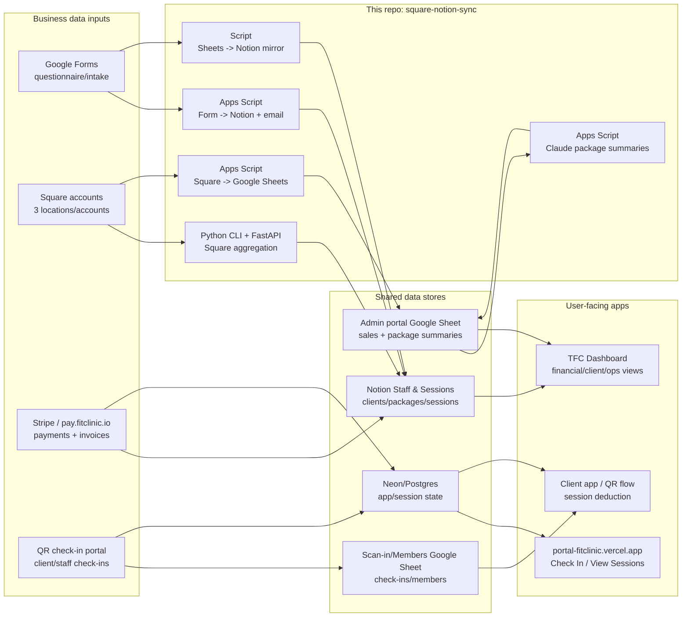

# Fit Clinic project context and ecosystem map

This file is a durable handoff note for future agents. Read it before assuming
that every Fit Clinic item lives in this repository.

## Why this file exists

Several Fit Clinic systems are related at the business/process level but are
separate codebases, deployments, or no-code automations. The recurring source
of confusion is that the names overlap:

- Square, Notion, Google Sheets, Stripe, Vercel, and the QR check-in portal are
  all part of the same operating system for The Fit Clinic.
- This repository, `square-notion-sync`, is only one integration layer inside
  that system.
- The QR check-in/client app and the public portal are adjacent systems. They
  should integrate with this repo's data outputs, but they are not necessarily
  implemented here.

## Current repository: `square-notion-sync`

Primary responsibility:

- Aggregate and inspect Square data across multiple Fit Clinic Square accounts.
- Provide CLI/FastAPI helpers for Square customer, transaction, invoice, and
  Notion sync workflows.
- Provide Google Apps Script templates for operational automations:
  - Google Forms responses -> email notification -> Notion page/data source.
  - Square current-month sales -> Google Sheet rows.
  - Claude package summarization from each Square transaction row.

Important files:

- `src/multi_account.py` - multi-account Square aggregation engine.
- `fastapi/app.py` - FastAPI API surface for Square sync helpers.
- `scripts/mirror_questionnaires_to_notion.py` - batch Google Sheet -> Notion
  questionnaire mirror.
- `google-apps-script/form_to_notion.gs` - real-time form submission -> Notion
  Apps Script.
- `google-apps-script/square_monthly_sales_report.gs` - Square sales import
  Apps Script.
- `google-apps-script/claude_package_summarizer.gs` - Claude summary Apps
  Script.
- `GOOGLE_FORMS_TO_NOTION_AUTOMATION.md` - setup guide for form submissions.
- `SQUARE_SALES_CLAUDE_APPS_SCRIPT.md` - setup guide for Square sales summaries.

## Separate but related projects

Treat these as separate project surfaces unless proven otherwise:

| Project/system | Role | Relationship to this repo |
| --- | --- | --- |
| `square-notion-sync` | Square/Notion/Sheets/Claude integration layer | Current repo |
| `portal-fitclinic.vercel.app` | Public portal with Check In and View My Sessions links | Consumes backend/session data; not hosted here |
| QR check-in/client app | Client scan-in, session deduction, session balance display | Adjacent app; should integrate with session data |
| `pay.fitclinic.io` / TFC Portal | Stripe payment and invoice flow | Feeds purchases/session packages into operational data |
| TFC Dashboard | Leadership dashboard for financial/client/ops views | Consumes aggregated data from Sheets/Notion/DB |
| Notion Staff & Sessions workspace | Operational source of truth for clients, sessions, packages, payroll | Destination/source for syncs |
| Admin portal Google Sheet | Suggested workbook for Square sales report + Claude summaries | Apps Script target |
| Scan-in/Members Google Sheet | Existing check-in/member tracking workbook | Do not mix sales reports here unless intentionally requested |
| Neon/Postgres database | Likely app/session persistence layer for client portal/check-ins | Not managed by this repo unless explicitly added |

## Visual ecosystem diagram

## Live links and IDs already identified

- Public portal: `https://portal-fitclinic.vercel.app`
- Check-in page: `https://portal-fitclinic.vercel.app/checkin.html`
- Check-in API shape: `https://portal-fitclinic.vercel.app/api/checkin?id=CODE`
- Official Notion page/database link:
  `https://fitclinic.notion.site/34d72568b32a8181832be8eb6a9f0822?v=34d72568b32a8129a7c2000c5aa773e3&source=copy_link`
- Notion data source ID for the Google Forms automation:
  `34d72568-b32a-814e-9e2b-000b7b75a88a`
- Admin portal Google Sheet ID:
  `1x5I9-qOCjEER3gIHnX2Ds-C-xhdo92hQTX0vpeohLHY`
- Scan-in/Members Google Sheet ID:
  `1-D1MCAJYb6rqZ3gmGHqB_q2FCEs74paAQ4MTsi06MhU`

## Known test results from prior session

Portal/check-in:

- `https://portal-fitclinic.vercel.app` loaded publicly.
- `https://portal-fitclinic.vercel.app/checkin.html` loaded publicly.
- `/api/checkin` returned:
  - Missing ID -> `400 Missing client ID`.
  - Fake code -> `404 not_found` with the expected hint.
- Full successful check-in was not tested because no safe real test code was
  provided.

Session lookup:

- `https://portal-fitclinic.vercel.app/client` loaded publicly.
- It attempted to call `https://square-notion-sync.vercel.app/portal/lookup`.
- That endpoint returned Vercel `404`, so "View My Sessions" was not fully
  wired at that time.

Assets:

- Missing portal assets were observed:
  - `/Page-Not-Found-3.jpeg`
  - `/TFC_Logo.png`
  - `/favicon.ico`

## Current unification strategy

Use this rule when deciding where new work belongs:

1. If work is about extracting/transforming Square, Google Sheets, Notion, or
   Claude summaries, it likely belongs in this repo.
2. If work is about QR scanning UI, session deduction UX, member check-ins, or
   client session balance display, it likely belongs in the QR/client portal
   repo.
3. If work is about invoices, packages for sale, Stripe checkout, or payment
   links, it likely belongs in the payment/portal project.
4. If work is about executive reporting across systems, it likely belongs in
   the dashboard project, consuming data from Sheets/Notion/DB.
5. If work requires shared state across apps, agree on the source of truth first
   (Notion, Google Sheets, Neon/Postgres, or Square) before writing code.

## Security and credential rules

- Never commit live access tokens, API keys, service account JSON, OAuth client
  secrets, database passwords, or `.env` files.
- If credentials appear in chat/transcripts, assume they need rotation.
- Store Apps Script secrets only in Apps Script Project Settings -> Script
  Properties.
- Store local/server secrets only in environment variables or platform secret
  managers.

## Suggested next pickup tasks

1. Confirm the source of truth for session balances:
   - Notion, Google Sheets, Neon/Postgres, Square, or Stripe-derived packages.
2. Fix the client portal session lookup backend:
   - Implement or deploy `/portal/lookup`, or update the frontend to call the
     correct backend.
3. Test a real check-in with a safe test client code.
4. Restore missing portal image/favicon assets.
5. Run the Apps Script Square sales import in the Admin portal Sheet with
   Script Properties configured.
6. Run the Claude package summarizer and inspect the package inference output.
